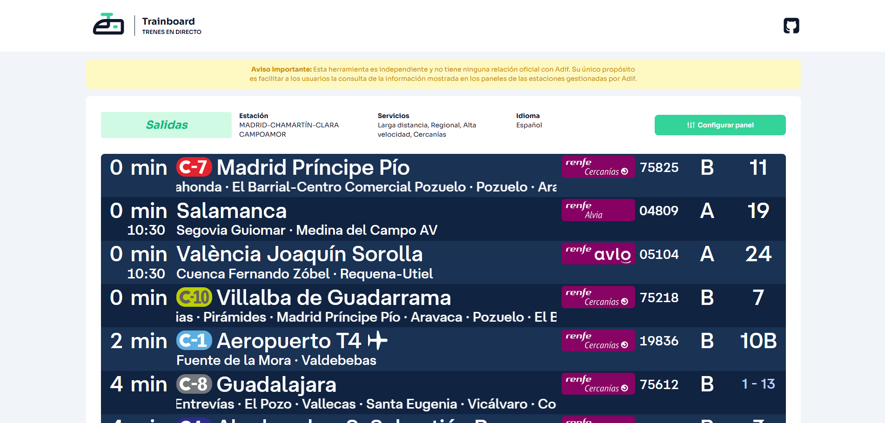

# 🚆 TRAINBOARD



Una aplicación creada con web-components para consultar **pantallas de horarios ferroviarios** en España.  
Desarrollada con [Lit Element](https://lit.dev/), [Tailwind CSS](https://tailwindcss.com/) y [Vite](https://vitejs.dev/) para ofrecer velocidad, claridad y un diseño adaptado a pantallas de visualización en el sistema ferroviario de Españá.

---

## ✨ Características

- 📍 Visualiza horarios de estaciones ferroviarias de España.
- ⚡ Interfaz rápida y responsive gracias a Vite y Tailwind.
- 🧩 Componentes reutilizables con Lit Element.
- 📺 Optimizado para pantallas de información públicas.

---

## 🛠️ Tecnologías

- **Librería**: [Lit Element](https://lit.dev/)
- **Estilos**: [Tailwind CSS](https://tailwindcss.com/)
- **Empaquetador**: [Vite](https://vitejs.dev/)
- **Testing**: [Open-Wc Testing](https://open-wc.org/docs/testing/testing-package/#chai)

---

## 🚀 Instalación

```bash
# 1. Clona el repositorio
git clone https://github.com/carlosuidev/trainboard-app.git
cd trainboard-app

# 2. Instala las dependencias
npm install

# 3. Inicia el servidor de desarrollo
npm run dev
```

## 🧪 Testing

```bash
npm run test
```

---

**AVISO**
Esta herramienta es independiente y no tiene ninguna relación oficial con Adif. Su único propósito es facilitar a los usuarios la consulta de la información mostrada en los paneles de las estaciones gestionadas por Adif.
